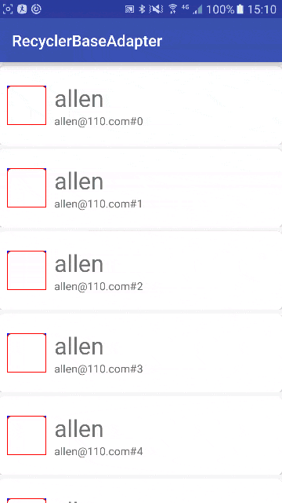

##简单的图片示例:  

RecyclerViewBaseAdapter相比BaseRecyclerViewAdapter有以下几点优化:  
1.泛型应用优化
---
原来的数据传递给子类时是没有带泛型的,需要子类自己去做强转,而这里我们已经通过泛型解决了些问题,子类在使用时不需要进行强转,直接使用.
2.填充数据优化
---
这里我们使用了一个带final修辞的list来作为数据源,在添加数据时,我们先去除重复数据,然后,再添加新数据,这个在做下拉刷新时,非常好用,我不
需要先清空data,而是直接添加数据就可以了.保证新添加的数据能被添加进来,而旧的已加载的数据,不需要再被重新加载.  
**注意**  
这里的去除重复数据,需要实体类实现``hashCode()``和``equals()``两个方法  
3.错误提示优化
---
如果是做预加载出现错误或者当没有更多数据时的提示文字,都是滑动到最底部才会提示.当出现网络请求错误时,错误信息需要子类添加到父类,然后,当滑动到进度条后才显示错误信息,
如:  
当网络请求出现错误时,添加错误信息  
    
        public void addErrorInfo(String errorInfo) {
            this.errorString = errorInfo;
        }
    
        public void addDatas(List<DataInfo> list) {
            //当数据请求正常时,将其置为空
            errorString = null;
            super.addData(list);
        }
    }
通过实现下面方法,来传递给父类:  

    @Override
    protected String getErrorString() {
        return errorString;
    }
最后父类获取到错误信息,当滑动到最底部时,toast错误信息:  

        @Override
        public int getItemViewType(int position) {
            if (mData.size() == position) {
    
                if (!TextUtils.isEmpty(getErrorString())) {
                    toast(getErrorString());
                }
    
                return VIEW_PROGRESS;
            } else {
                return VIEW_Item;
            }
        }  
4.重复数据处理
---
当所有的数据都是重复数据时,这时收起加载进度条:  
    
        public void addData(List<D> items) {
            boolean isChangeData = items.removeAll(mData);
    
            if (items.size() == 0) {
                //走到这里,说明加载的数据全部为重复数据,所以数据没有变化
                if (mProgressBarView != null) {
                    mProgressBarView.setVisibility(View.GONE);
                    mNotMoreDataView.setVisibility(View.GONE);
                }
            }
    
            mData.addAll(items);
    
            notifyDataSetChanged();
        }
5.最佳实践
---
当加载到数据后,处理数据的最佳实践:  
    
    if (mAdapter == null) {
    
                LinearLayoutManager manager = new LinearLayoutManager(this);
                mList.setLayoutManager(manager);
    
                mAdapter = new TwoTypeAdapter(this, mList);
                mAdapter.setOnItemClickListener((position, dataInfo) ->
                        handleItemClick(position, dataInfo));
    
                mAdapter.setOnLoadMoreListener(onLoadMoreListener);
                mAdapter.addDatas(datas);
    
                mList.setAdapter(mAdapter);
    
                mList.setVisibility(View.VISIBLE);
    
            } else {
                mAdapter.addDatas(datas);
            }
            
            //每次加载完成后,设置该方法,让其可以继续加载更多
            mAdapter.setLoadMoreCompleted();